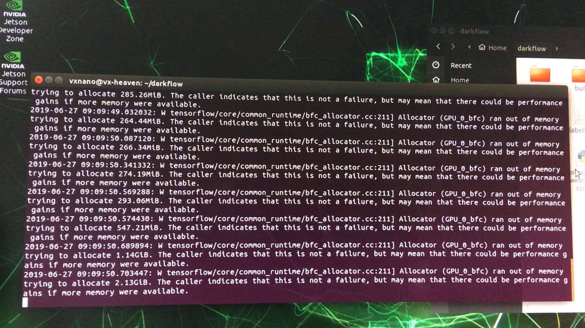
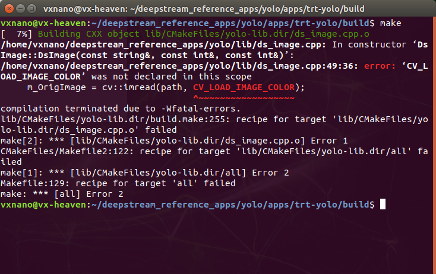
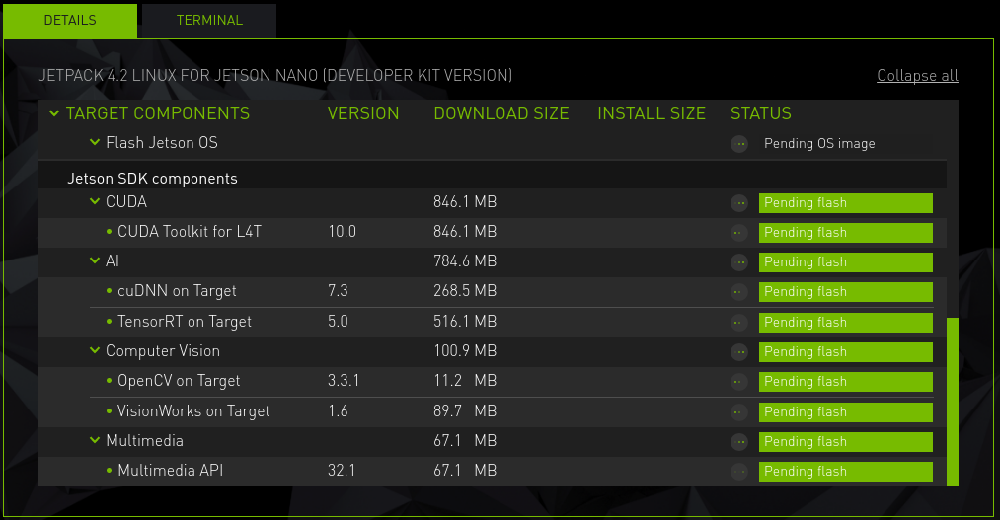
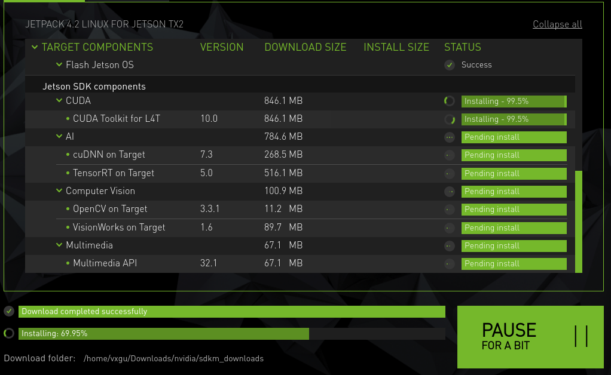

20190627

yolo是直接c++训练好的模型直接跑效率高，还是tf训练好的模型跑起来性能高。
是不是都能用tensorRT。

# 尝试yolo-tf

参考https://github.com/valdivj/jetson-nano-yolov2-darkflow

配置nano，tensorflow、opencv等的安装都走了一遍。

但结果不好。

跑的是yolov2-tiny-voc模型，nano跑在这里就直接掉电了。因为内存不足。

总结一下，他的优化只要是内存采用swap扩为6G。

# 发现官方竟然有benchmark，而且还很多！！！！

https://devtalk.nvidia.com/default/topic/1050377/jetson-nano/deep-learning-inference-benchmarking-instructions/

https://developer.nvidia.com/embedded/jetson-nano-dl-inference-benchmarks

测试其中的Tiny YOLO v3，安装过程中出现opencv的错误，这个系统是直接flash的nano 的image，原版带没带opencv？下次记得试试。

干脆刷机**JetPack 4.2**。

sdkmanager的好处是把主机和nano的系统都给配置好了。

https://docs.nvidia.com/sdk-manager/download-run-sdkm/index.html

https://docs.nvidia.com/sdk-manager/install-with-sdkm-jetson/index.html

刷机后，一切正常，测试
